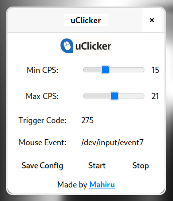

# uClicker (GTK UI)

**uClicker** is a fast, minimal Linux autoclicker with a clean GTK-based GUI.  
It interacts directly with `/dev/input/` for raw device access, making it fully **Wayland-compatible** and perfect for use cases like **Minecraft PvP** or **automation**.



---

## ⚙️ Features

- 🖱️ **Raw input** device access via `/dev/input/eventX`
- 🔑 Customizable **trigger key**
- ⚡ Adjustable **CPS range**
- 🧠 Undetectable by most anti-cheats
- 🧩 Works under **Wayland** and **X11**
- 💾 Config is saved to `~/.config/uClicker/uClicker.conf`

---

## 📦 Dependencies

You’ll need:

- `gtk3` (for the GUI)
- `gcc` & `make` (for building)
- `pkg-config` (for detecting GTK and other libs during build)
- `evtest` (optional, to identify input devices)
- *(Optional, recommended)* udev rules + `input` group membership to run backend without sudo

> On minimal installs you may also need a build toolchain like `base-devel` (Arch) or `build-essential` (Debian/Ubuntu).

### Arch Linux
```bash
sudo pacman -S --needed base-devel pkgconf gtk3 evtest
```

### Debian/Ubuntu
```bash
sudo apt update
sudo apt install build-essential pkg-config libgtk-3-dev evtest
```

### Fedora
```bash
sudo dnf install @development-tools pkgconf-pkg-config gtk3-devel evtest
```

---

## 🚀 Build (gtk-ui branch)

```bash
git clone -b gtk-ui https://github.com/m-ahiru/uClicker.git
cd uClicker
make
```

This builds the GUI (`uClicker`) and backend (`autoclicker_backend`).  
Some warnings are fine—continue with the next steps.

---

## ▶️ Usage

### 1) Find your mouse event path
```bash
sudo evtest
```
Pick your mouse; note the event path (e.g. `/dev/input/event7`), and put it into the GUI or the config.

### 2) Start the GUI
```bash
./uClicker
```
- Set Min/Max CPS
- Enter trigger key code (e.g. 275 for BTN_SIDE)
- Set `mouse_event_path` (e.g. `/dev/input/event7`)
- **Save Config**
- Start/Stop the backend

> The GUI runs as your normal user. Avoid launching it with `sudo`.

---

## 💾 Config File

Location:
```
~/.config/uClicker/uClicker.conf
```

Example:
```
min_delay_us=55555
max_delay_us=83333
trigger_code=275
mouse_event_path=/dev/input/event7
```

---

**Recommended: run backend without sudo (so config stays user-owned):**
```bash
# Add your user to input group
sudo usermod -aG input "$USER"

# Allow access to /dev/uinput and /dev/input/event*
sudo tee /etc/udev/rules.d/99-uinput.rules > /dev/null <<'EOF'
KERNEL=="uinput", MODE="0660", GROUP="input"
KERNEL=="event*", SUBSYSTEM=="input", MODE="0640", GROUP="input"
EOF
sudo udevadm control --reload
sudo udevadm trigger

# Load uinput now and on boot
sudo modprobe uinput
echo uinput | sudo tee /etc/modules-load.d/uinput.conf >/dev/null

# Re-login (or reboot) so your group membership takes effect
```

Quick checks:
```bash
# Should show your username and proper perms
stat -c '%U:%G %a %n' ~/.config/uClicker ~/.config/uClicker/uClicker.conf

# Should say "writable"
test -w ~/.config/uClicker/uClicker.conf && echo "writable" || echo "NOT writable"
```

If you ever launched the GUI with sudo and broke ownership again:
```bash
sudo chown -R "$USER":"$USER" ~/.config/uClicker
```

---

## 🛠 Troubleshooting

**Problem:** *Config file exists but doesn’t update when clicking “Save”*  
**Cause:** File or folder belongs to `root` (often happens if backend runs with sudo first).  
**Fix:**
```bash
sudo chown -R "$USER":"$USER" ~/.config/uClicker
chmod 700 ~/.config/uClicker
chmod 600 ~/.config/uClicker/uClicker.conf
```

**Problem:** *GUI can read config but not write*  
**Check permissions:**
```bash
stat -c '%U:%G %a %n' ~/.config/uClicker ~/.config/uClicker/uClicker.conf
test -w ~/.config/uClicker/uClicker.conf && echo "schreibbar" || echo "NICHT schreibbar"
```
If owner is not you, run the `chown` fix above.

**Problem:** *Still breaks after using sudo*  
Don’t run the GUI with sudo. Prefer running backend without sudo via the udev rules above.

**Problem:** *Where does the app actually read/write?*  
Trace file openings to confirm the exact path:
```bash
strace -e openat ./uClicker 2>&1 | grep uClicker.conf
```

**Problem:** *Which key code is my trigger?*  
Use `evtest` and press your desired button to see the code.

---

## 🛑 Stop Everything

- Use the **Stop** button in the GUI to kill the backend.
- Exiting the GUI also stops the backend automatically.

---

## 🧠 Notes

- Run the GUI from the project root so assets load (`./uClicker`).
- If you keep using sudo for the backend, make sure it never touches the config path.

---

## ❗ Disclaimer

This tool is for **educational/personal use** only.  
Using autoclickers in online games may **violate terms of service**. Use responsibly.
