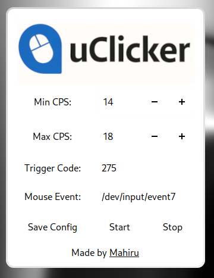

# uClicker

**uClicker** is a fast, undetectable, and minimal universal Linux autoclicker with a clean GTK-based GUI.  
It interacts directly with `/dev/input/` for raw device access, making it fully **Wayland-compatible**, and perfect for use cases like **Minecraft PvP** kr **automation**.



---

## ⚙️ Features

- 🖱️ **Raw input** device access via `/dev/input/eventX`
- 🔑 Customizable **trigger key**
- ⚡ Adjustable **CPS range**
- 🧠 Undetectable by most anti-cheats
- 🧩 Works under **Wayland** and **X11**
- 💾 Config is saved to `~/.config/uClicker/uClicker.conf`

---

## 📦 Dependencies

You’ll need:

- `gtk3`
- `gcc`
- `make`
- `evtest` (for identifying input devices)
- `sudo` (to access `/dev/input/`)

### 🐧 Install on Arch Linux:

```bash
sudo pacman -S gtk3 base-devel evtest
```

---

## 🚀 Installation

### 1. Clone the repo

```bash
git clone https://github.com/m-ahiru/uClicker.git
cd uClicker
```

### 2. Build the app

```bash
make
```

This compiles both the backend (`autoclicker_backend`) and the GUI frontend (`uClicker`).
Getting error messages at this part is *normal* just continue with the next steps.

---

## ▶️ Usage

### Step 1: Find your mouse event path

Run:

```bash
sudo evtest
```

Then select your mouse and note the event path  
(e.g. `/dev/input/event7`)

---

### Step 2: Start the GUI

```bash
./uClicker
```

> The GUI runs as your normal user and lets you:
> - Set your CPS range (Min/Max)
> - Enter your trigger key code
> - Set the mouse event path
> - Save your config
> - Start or stop the backend clicker

When you press your chosen trigger key (e.g. `F6`), the backend will start clicking in your desired CPS range.

---

## 🔧 Backend Details

The backend binary is `autoclicker_backend`  
It requires `sudo` because it reads from `/dev/input/`

The GUI handles backend control by:
- Saving your settings
- Killing old backend instances
- Launching a fresh one with updated config

---

## 💾 Config File

Config is saved at:

```
~/.config/uClicker/uClicker.conf
```

Example:

```
min_delay_us=55555
max_delay_us=62500
trigger_code=275
mouse_event_path=/dev/input/event7
```

---

## 🛑 Stop Everything

Clicking **"Stop"** in the UI will kill the backend.
Exiting the GUI also automatically stops it.

---

## 🧠 Important Notes

- The app **must be run from the project root** (`./uClicker`) so the logo/screenshot assets are found.
- The backend runs with `sudo`, but config and GTK stay in user context.

---

## ❗ Disclaimer

This tool is provided for **educational and personal use only**.  
Using autoclickers in online games may **violate terms of service**.  
Use responsibly and at your own risk.

---
