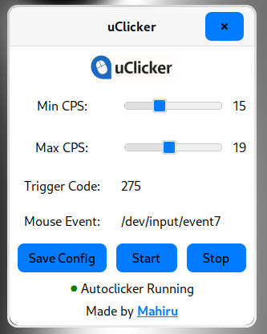

# uClicker

**uClicker** is a fast, undetectable, and minimal universal Linux autoclicker with a clean GTK-based GUI.  
It interacts directly with `/dev/input/` for raw device access, making it fully **Wayland-compatible**, and perfect for use cases like **Minecraft PvP** or **automation**.



---

## ⚙️ Features

- 🖱️ **Raw input** device access via `/dev/input/eventX`
- 🔑 Customizable **trigger key**
- ⚡ Adjustable **CPS range**
- 🧠 Undetectable by most anti-cheats
- 🧩 Works under **Wayland** and **X11**
- 💾 Config is saved to `~/.config/uClicker/uClicker.conf`

---

## 📦 Dependencies

You’ll need:

- `gtk3` (for the GUI)
- `gcc` & `make` (for building)
- `pkg-config` (for detecting GTK and other libs during build)
- `evtest` (optional, for identifying input devices)
- `sudo` **or** udev rules that give your user access to `/dev/input/*` and `/dev/uinput` (recommended for running without root)
- *(Optional)* `libevdev` development package if you implement automatic device discovery later

> **Note:** On minimal installations you may also need a complete build toolchain package such as `base-devel` (Arch) or `build-essential` (Debian/Ubuntu).

### 🐧 Install on Arch Linux:
```bash
sudo pacman -S --needed base-devel pkgconf gtk3 evtest
```

### 📀 Install on Debian/Ubuntu:
```bash
sudo apt update
sudo apt install build-essential pkg-config libgtk-3-dev evtest
```

### 🧢 Install on Fedora:
```bash
sudo dnf install @development-tools pkgconf-pkg-config gtk3-devel evtest
```


---

## 🚀 Installation

### 1. Clone the repo

```bash
git clone https://github.com/m-ahiru/uClicker.git
cd uClicker
```

### 2. Build the app

```bash
make
```

This compiles both the backend (`autoclicker_backend`) and the GUI frontend (`uClicker`).
Getting error messages at this part is *normal* just continue with the next steps.

---

## 🚫 Run Without sudo (recommended)

By default, only root can read `/dev/input/event*` and write to `/dev/uinput`.  
To run uClicker as a normal user:

### 1. Add your user to the `input` group
```bash
sudo usermod -aG input $USER
```  
Log out and back in afterwards.

### 3. Create udev rules
```bash
sudo sh -c 'cat >/etc/udev/rules.d/99-uinput.rules << "EOF"
```
```   
KERNEL=="uinput", MODE="0660", GROUP="input"
KERNEL=="event*", SUBSYSTEM=="input", MODE="0640", GROUP="input"
EOF'  
```
```bash
sudo udevadm control --reload  
sudo udevadm trigger
```

### 5. Load `uinput` (and persist across reboots)
```bash 
sudo modprobe uinput  
echo uinput | sudo tee /etc/modules-load.d/uinput.conf >/dev/null
```

### 7. Verify devices
```bash
ls -l /dev/uinput /dev/input/event*  
```
# Group should be 'input', permissions should allow group rw for uinput and r for event*

Now you can run the backend without sudo.

---

## ▶️ Usage

### Step 1: Find your mouse event path

Run:

```bash
sudo evtest
```

Then select your mouse and note the event path  
(e.g. `/dev/input/event7`)

---

### Step 2: Start the GUI

```bash
./uClicker
```

> The GUI runs as your normal user and lets you:
> - Set your CPS range (Min/Max)
> - Enter your trigger key code
> - Set the mouse event path
> - Save your config
> - Start or stop the backend clicker

When you press your chosen trigger key (e.g. `F6`), the backend will start clicking in your desired CPS range.

---

## 🔧 Backend Details

The backend binary is `autoclicker_backend`  
It requires `sudo` because it reads from `/dev/input/`

The GUI handles backend control by:
- Saving your settings
- Killing old backend instances
- Launching a fresh one with updated config

---

## 💾 Config File

Config is saved at:

```
~/.config/uClicker/uClicker.conf
```

Example:

```
min_delay_us=55555
max_delay_us=62500
trigger_code=275
mouse_event_path=/dev/input/event7
```

---

## 🛑 Stop Everything

Clicking **"Stop"** in the UI will kill the backend.
Exiting the GUI also automatically stops it.

---

## 🧠 Important Notes

- The app **must be run from the project root** (`./uClicker`) so the logo/screenshot assets are found.
- The backend runs with `sudo`, but config and GTK stay in user context.

---

## ❗ Disclaimer

This tool is provided for **educational and personal use only**.  
Using autoclickers in online games may **violate terms of service**.  
Use responsibly and at your own risk.

---
